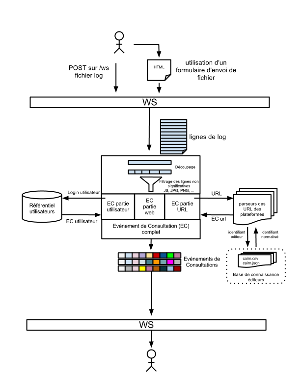

# Documentation développeur: coeur d'ezPAARSE #

Documentation orientée développeur du coeur d'ezPAARSE. La documentation développeur concernant la contribution aux parseurs, pkb et scrapers peut être consulté dans [cette rubrique](./developer-plateforms.html).

## Technologies utilisées par ezPAARSE

* [nodejs](http://nodejs.org/) pour le coeur d'ezPAARSE (performances et sa gestion avancée du streaming).
* [git](http://git-scm.com/) pour gérer les bases de connaissances éditeurs et le code source.
* [php](http://php.net), [perl](http://www.perl.org/), [python](http://www.python.org/) ou autres langages pour l'écriture des parseurs.

## Fonctionnement du moteur d'ezPAARSE




## Lancer les tests unitaires d'ezPAARSE

Pour effectuer les tests d'une fonctionnalité précise, il faut utiliser mocha et indiquer en paramètre le chemin du fichier de tests.

Par exemple pour le test de formats personnalisés :
```console
. ./bin/env
mocha ./test/custom-formats-test
```

Pour effectuer un seul des tests d'une fonctionnalité, il faut utiliser mocha et indiquer en paramètre le chemin du fichier de tests puis, via un ``-g``, préciser le numéro du test en deux chiffres sous la forme ``@xx``.

Par exemple pour le deuxième test de formats personnalisés :
```console
. ./bin/env
mocha ./test/custom-formats-test -g @02
```

Pour effectuer le test d'une seule plate-forme, il faut utiliser mocha et indiquer en paramètre le chemin du fichier de tests des plate-formes puis, via un ``-g``, préciser le nom de la plate-forme.

Par exemple pour le test de Science Direct :
```console
. ./bin/env
mocha ./test/platforms-test -g sd
```

## Générer une version d'ezPAARSE ##

Pour générer une nouvelle version d'ezPAARSE plusieurs étapes semi-automatiques sont nécessaires :

- S'assurer de ne pas avoir de modification locales en attente: `git status` permet de s'en assurer.

- Modifier le numéro de version des différents fichiers concernés (bien entendu, remplacez `0.0.3` par le numéro souhaité) :
```console
make version v=0.0.3
git commit -a -m "Version 0.0.3"
git push
```

- Créer un tag git correspondant à la version précédemment créée :
```console
make tag
```

- Créer une archive tar.gz :
```
make tar
```

- Créer une archive debian (.deb) :
```console
make deb
```

- Créer une archive rpm (.rpm) :
```console
make rpm
```

- Créer une archive windows (.exe) :
```console
make exe
```

- Envoyer le tout sur le serveur [AnalogIST](http://analogist.couperin.org) pour mettre la version à disposition de la communauté :
```console
make upload
```

## Générer une archive snapshot d'ezPAARSE ##

Le numéro de version `latest` doit être utilisé pour générer un snapshot (une archive de la version de développement).

```
make tar v=latest
make deb v=latest
make rpm v=latest
make exe v=latest
make upload v=latest
```

Le numéro de version aura cette forme : `AAAAMMJJ<commitid>`  
Exemple: `201303240bc258f` (24 mars 2013 commit id = 0bc258f)

## Contributions à ezPAARSE-arborescence ezPAARSE

Lors d'une contribution, se référer à [l'arborescence ezPAARSE](/doc/tree.html) pour savoir où déposer vos fichiers

## Mettre à jour les version des librairies d'ezPAARSE ##

Les librairies d'ezPAARSE sont les différents modules npm et bower.
Elles sont présentes dans les répertoires suivants :
- ezpaarse/node_modules/
- ezpaarse/public/components/
- ezpaarse/platforms-scrapers/node_modules/

Un [dépôt github](https://github.com/ezpaarse-project/ezpaarse-libs) est dédié à la mise à disposition des snapshots de ces librairies.

Le script [upgrade-ezpaarse-libs](https://github.com/ezpaarse-project/ezpaarse-libs/blob/master/upgrade-ezpaarse-libs) permet de mettre à jour les paquets npm et bower présents dans ce dépôt en respectant les dépendances exprimées dans les dépôts github d'ezpaarse :
- [package.json](https://github.com/ezpaarse-project/ezpaarse/blob/master/package.json) d'ezpaarse
- [bower.json](https://github.com/ezpaarse-project/ezpaarse/blob/master/bower.json) d'ezpaarse
- [package.json](https://github.com/ezpaarse-project/ezpaarse-scrapers/blob/master/package.json) d'ezpaarse-scrapers

Pour mettre à jour ces librairies, il est donc dans un premier temps nécessaire de mettre à jour les package.json et bower.json de la distribution d'ezPAARSE (utilisation de l'utilitaire npm-check-updates) puis de tester qu'ezPAARSE fonctionne correctement :
```bash
cd ezpaarse/
npm install npm-check-updates
./node_modules/.bin/npm-check-updates -u
npm update

make restart
make test
```

Concernant bower :
```bash
cd ezpaarse/
bower update
```
Puis il faut tester manuellement l'interface Web d'ezPAARSE.

Quand les tests sont au vert, on peut alors commiter/pusher les package.json et bower.json dans le git.

On peut ensuite cloner le dépôt [ezpaarse-libs](https://github.com/ezpaarse-project/ezpaarse-libs) puis exécuter le script upgrade-ezpaarse-libs qui se chargera de télécharger les bonnes versions des paquets depuis les packages.json et bower.json présents dans le code source d'ezpaarse.

Il reste ensuite à commiter/pusher les changements dans le dépôt ezpaarse-libs :
```bash
cd ezpaarse-libs/
./upgrade-ezpaarse-libs
git status .
git add .
git commit .
git push
```